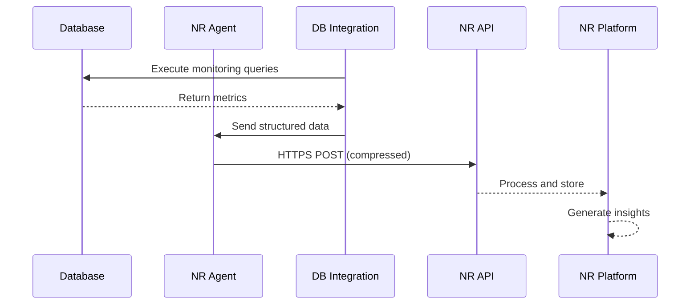

# Architecture Documentation

## System Architecture Overview

This reference implementation follows a modular, cloud-native architecture designed for scalability, security, and maintainability.

```
┌─────────────────────────────────────────────────────────────────────────┐
│                           New Relic One Platform                         │
│  ┌─────────────┐  ┌──────────────┐  ┌────────────┐  ┌───────────────┐ │
│  │Infrastructure│  │  Database    │  │   Query    │  │    Custom     │ │
│  │  Dashboard   │  │  Monitoring  │  │Performance │  │  Dashboards   │ │
│  └─────────────┘  └──────────────┘  └────────────┘  └───────────────┘ │
└─────────────────────────────────┬───────────────────────────────────────┘
                                  │ HTTPS/TLS
                                  │
┌─────────────────────────────────┴───────────────────────────────────────┐
│                          Monitoring Infrastructure                        │
│  ┌─────────────────────────────────────────────────────────────────┐   │
│  │                    EC2 Monitoring Instance                       │   │
│  │  ┌─────────────┐  ┌──────────────┐  ┌────────────────────────┐ │   │
│  │  │  New Relic  │  │MySQL/Postgres│  │   Custom Metrics      │ │   │
│  │  │Infrastructure│  │ Integrations │  │   Query Configs       │ │   │
│  │  │    Agent    │  │              │  │                       │ │   │
│  │  └──────┬──────┘  └──────┬───────┘  └──────────┬────────────┘ │   │
│  │         │                 │                      │              │   │
│  │         └─────────────────┴──────────────────────┘              │   │
│  │                           │                                      │   │
│  └───────────────────────────┼──────────────────────────────────────┘   │
│                              │ Secure Database Connections              │
└──────────────────────────────┼──────────────────────────────────────────┘
                               │
┌──────────────────────────────┴──────────────────────────────────────────┐
│                          Database Infrastructure                          │
│  ┌─────────────────┐  ┌─────────────────┐  ┌─────────────────┐         │
│  │   MySQL Primary │  │ MySQL Replicas  │  │   PostgreSQL    │         │
│  │                 │  │                 │  │    Cluster      │         │
│  └─────────────────┘  └─────────────────┘  └─────────────────┘         │
└──────────────────────────────────────────────────────────────────────────┘
```

## Component Architecture

### 1. Infrastructure Layer (Terraform)

```hcl
Infrastructure Components:
├── Compute
│   ├── EC2 Instance (Monitoring Server)
│   ├── Instance Profile (IAM Role)
│   └── User Data (Bootstrap Script)
├── Networking
│   ├── Security Group
│   ├── Network ACLs
│   └── VPC Endpoints (Optional)
├── Storage
│   ├── EBS Volumes (Encrypted)
│   └── S3 Buckets (Config Backup)
└── Security
    ├── KMS Keys
    ├── Secrets Manager
    └── SSM Parameters
```

**Key Design Decisions:**
- **Single Instance Pattern**: One monitoring instance can handle 100+ databases
- **Immutable Infrastructure**: Instances are replaced, not updated
- **Secure by Default**: All storage encrypted, minimal network exposure
- **Cloud-Native**: Leverages AWS services for security and scalability

### 2. Configuration Management Layer (Ansible)

```yaml
Ansible Architecture:
├── Inventory Management
│   ├── Dynamic Inventory
│   ├── Group Variables
│   └── Host Variables
├── Playbooks
│   ├── Site.yml (Main Orchestrator)
│   ├── Install-NewRelic.yml
│   └── Configure-Databases.yml
├── Roles
│   ├── newrelic-infrastructure
│   ├── mysql-integration
│   └── postgresql-integration
└── Templates
    ├── Agent Configuration
    ├── Integration Configs
    └── Custom Queries
```

**Configuration Flow:**
1. **Agent Installation**: Repository setup, package installation, service enablement
2. **Integration Setup**: Database-specific packages and configurations
3. **Custom Metrics**: Query definitions and collection intervals
4. **Service Validation**: Health checks and connectivity tests

### 3. Monitoring Configuration

#### Database Credentials Management
```yaml
Credential Flow:
1. AWS Secrets Manager / Parameter Store
   └── Encrypted at rest
2. Ansible Vault (Alternative)
   └── Encrypted in repository
3. Runtime Injection
   └── Environment variables
4. New Relic Agent
   └── Secure transmission
```

#### Query Performance Monitoring Architecture

**PostgreSQL Implementation:**
```sql
Components:
├── pg_stat_statements
│   ├── Query normalization
│   ├── Execution statistics
│   └── Resource consumption
├── pg_stat_database
│   ├── Connection metrics
│   ├── Transaction rates
│   └── Cache hit ratios
└── Custom Queries
    ├── Long running queries
    ├── Lock analysis
    └── Index usage
```

**MySQL Implementation:**
```sql
Components:
├── performance_schema
│   ├── Statement events
│   ├── Wait events
│   └── Stage events
├── information_schema
│   ├── Table statistics
│   ├── Index statistics
│   └── Engine status
└── Custom Queries
    ├── Slow query analysis
    ├── Lock wait detection
    └── Replication status
```

### 4. Data Flow Architecture



**Data Collection Intervals:**
- Infrastructure Metrics: 15 seconds
- Database Metrics: 30-60 seconds
- Query Performance: 60 seconds
- Custom Metrics: Configurable

### 5. Security Architecture

```
Security Layers:
├── Network Security
│   ├── Private Subnets
│   ├── Security Groups (Least Privilege)
│   ├── NACLs (Defense in Depth)
│   └── VPC Endpoints (Private Connectivity)
├── Identity & Access
│   ├── IAM Roles (No Long-term Credentials)
│   ├── Database Users (Read-only)
│   ├── MFA Requirements
│   └── Audit Logging
├── Data Protection
│   ├── Encryption in Transit (TLS 1.2+)
│   ├── Encryption at Rest (KMS)
│   ├── Secure Credential Storage
│   └── Data Retention Policies
└── Compliance
    ├── CIS Benchmarks
    ├── AWS Well-Architected
    ├── SOC2 Controls
    └── GDPR Compliance
```
