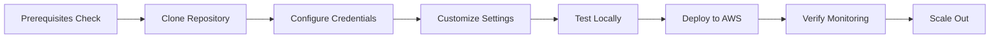

# New Relic Database Monitoring Reference Architecture

## Executive Summary

This reference implementation provides a production-ready, automated solution for deploying New Relic database monitoring across MySQL and PostgreSQL databases in AWS environments. Developed by the New Relic team, it demonstrates best practices for infrastructure automation, monitoring configuration, and operational excellence.

## Why This Reference Architecture?

### Business Value
- **Reduced Time to Value**: Deploy comprehensive database monitoring in minutes instead of hours
- **Standardized Approach**: Consistent monitoring configuration across all databases
- **Cost Optimization**: Identify performance bottlenecks and optimize database resources
- **Proactive Issue Detection**: Catch database problems before they impact users
- **Compliance Ready**: Audit trails and secure credential handling

### Technical Benefits
- **Infrastructure as Code**: Version-controlled, repeatable deployments
- **Automated Configuration**: Zero manual steps for agent and integration setup
- **Query Performance Insights**: Deep visibility into slow queries and wait events
- **Secure by Design**: Encrypted connections, minimal permissions, credential vaulting
- **Test-Driven Development**: Comprehensive test suite with LocalStack integration

## What's Included?

### 1. **Infrastructure Automation**
- Terraform modules for AWS EC2 provisioning
- Network security configuration
- Auto-scaling ready architecture
- Multi-region deployment support

### 2. **Configuration Management**
- Ansible playbooks for New Relic agent installation
- Database integration configuration
- Query performance monitoring setup
- Custom metric collection

### 3. **Database Monitoring Features**
- **MySQL Monitoring**:
  - Query digest analysis
  - Wait event tracking
  - Lock contention metrics
  - Replication monitoring
  - Table and index statistics
  
- **PostgreSQL Monitoring**:
  - Query performance via pg_stat_statements
  - Vacuum and bloat analysis
  - Connection pool metrics
  - Index usage statistics
  - Replication lag monitoring

### 4. **Operational Tools**
- Automated deployment scripts
- Health check validation
- Rollback capabilities
- Monitoring dashboard templates

### 5. **Testing Framework**
- Unit tests for configurations
- Integration tests with real databases
- End-to-end deployment testing
- Performance benchmarking tools

## Use Cases

### 1. **Enterprise Database Fleet Monitoring**
Deploy monitoring across hundreds of databases with consistent configuration and centralized visibility.

### 2. **Development Environment Monitoring**
Quickly spin up monitored development databases with the same configuration as production.

### 3. **Migration Projects**
Monitor both source and target databases during migration projects to ensure performance parity.

### 4. **Multi-Cloud Database Monitoring**
Extend the pattern to monitor managed database services (RDS, Aurora) with minimal changes.

### 5. **Compliance and Auditing**
Track database access patterns, query execution, and performance metrics for compliance requirements.

## Architecture Principles

### 1. **Modularity**
Each component (Terraform, Ansible, configuration) is independently versioned and testable.

### 2. **Idempotency**
All operations can be safely run multiple times without side effects.

### 3. **Security First**
- Least privilege access
- Encrypted data in transit and at rest
- No hardcoded credentials
- Support for secret management systems

### 4. **Observability Native**
- Self-monitoring capabilities
- Detailed logging and error reporting
- Performance metrics on the automation itself

### 5. **Cloud Native**
- Containerized testing
- CI/CD ready
- Auto-scaling compatible
- Multi-region aware

## Getting Started Path

### Quick Start for Different Personas

**For DevOps Engineers:**
1. Clone repository
2. Update terraform.tfvars
3. Run deployment script
4. Verify in New Relic One

**For Database Administrators:**
1. Review database permissions
2. Customize query monitoring settings
3. Add custom metrics queries
4. Monitor query performance

**For Security Teams:**
1. Review security configurations
2. Enable credential vaulting
3. Audit network policies
4. Verify encryption settings

## Success Metrics

After implementing this reference architecture, you should see:

- ✅ All databases visible in New Relic Infrastructure
- ✅ Query performance metrics available within 5 minutes
- ✅ Alert policies automatically created
- ✅ Custom dashboards populated with data
- ✅ Historical trending for capacity planning

## Support and Resources

### Documentation
- [Architecture Deep Dive](ARCHITECTURE.md)
- [Best Practices Guide](BEST_PRACTICES.md)
- [Troubleshooting Guide](TROUBLESHOOTING.md)
- [API Reference](API_REFERENCE.md)

### Community
- [New Relic Explorers Hub](https://discuss.newrelic.com)
- [GitHub Issues](https://github.com/newrelic/aws-db-monitoring-automation/issues)
- [New Relic Documentation](https://docs.newrelic.com)

### Training
- [New Relic University - Database Monitoring](https://learn.newrelic.com)
- [Hands-on Labs](https://github.com/newrelic/aws-db-monitoring-automation/labs)
- [Video Tutorials](https://youtube.com/newrelic)

## Next Steps

1. **Evaluate**: Test the solution in your development environment
2. **Customize**: Adapt configurations to your specific needs
3. **Deploy**: Roll out to production with confidence
4. **Optimize**: Use insights to improve database performance
5. **Contribute**: Share improvements back to the community

---

*This reference architecture is maintained by the New Relic team and represents current best practices for database monitoring deployment. For the latest updates, visit our [GitHub repository](https://github.com/newrelic/aws-db-monitoring-automation).*