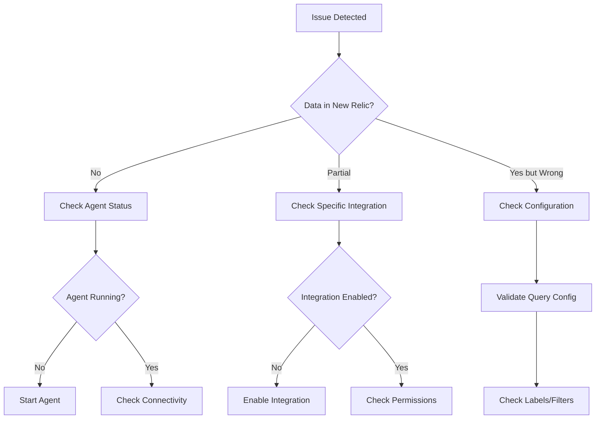

# Troubleshooting Guide

## Quick Diagnosis Flowchart



## Common Issues and Solutions

### 1. Agent Issues

#### Agent Not Starting

**Symptoms:**
- No data in New Relic Infrastructure
- `systemctl status newrelic-infra` shows failed state

**Diagnosis:**
```bash
# Check agent status
sudo systemctl status newrelic-infra

# View detailed logs
sudo journalctl -u newrelic-infra -n 100 --no-pager

# Check configuration syntax
sudo newrelic-infra -validate_config
```

**Common Causes & Solutions:**

1. **Invalid License Key**
   ```bash
   # Verify license key format
   grep license_key /etc/newrelic-infra.yml
   
   # Should be 40 characters, alphanumeric
   # Fix: Update with correct license key
   ```

2. **Network Connectivity Issues**
   ```bash
   # Test connectivity to New Relic
   curl -I https://infrastructure-api.newrelic.com/
   
   # Check DNS resolution
   nslookup infrastructure-api.newrelic.com
   
   # Fix: Update security groups, check NAT/Internet gateway
   ```

3. **Permissions Issues**
   ```bash
   # Check file permissions
   ls -la /etc/newrelic-infra.yml
   
   # Should be owned by root with 600 permissions
   sudo chown root:root /etc/newrelic-infra.yml
   sudo chmod 600 /etc/newrelic-infra.yml
   ```

#### Agent Running but No Data

**Diagnosis:**
```bash
# Check if agent is sending data
tail -f /var/log/newrelic-infra/newrelic-infra.log | grep "POST"

# Verify agent can reach API endpoint
sudo -u root curl -I https://infrastructure-api.newrelic.com/

# Check for proxy settings
env | grep -i proxy
```

**Solutions:**
1. **Proxy Configuration**
   ```yaml
   # /etc/newrelic-infra.yml
   proxy: http://your-proxy:8080
   ca_bundle_file: /etc/pki/ca-trust/extracted/pem/tls-ca-bundle.pem
   ```

2. **Time Sync Issues**
   ```bash
   # Check system time
   timedatectl status
   
   # Sync time if needed
   sudo chrony sources -v
   ```

### 2. Database Connection Issues

#### MySQL Connection Failures

**Error Messages:**
```
Error 1045: Access denied for user 'newrelic'@'host'
Error 2003: Can't connect to MySQL server
Error 1129: Host blocked because of many connection errors
```

**Troubleshooting Steps:**

1. **Test Connectivity**
   ```bash
   # From monitoring host
   mysql -h mysql.example.com -u newrelic -p -e "SELECT 1"
   
   # Check port accessibility
   nc -zv mysql.example.com 3306
   
   # Verify DNS resolution
   dig mysql.example.com
   ```

2. **Verify Permissions**
   ```sql
   -- On MySQL server
   SELECT user, host FROM mysql.user WHERE user = 'newrelic';
   SHOW GRANTS FOR 'newrelic'@'%';
   
   -- Check max connections
   SHOW VARIABLES LIKE 'max_connections';
   SHOW STATUS LIKE 'Threads_connected';
   ```

3. **SSL/TLS Issues**
   ```bash
   # Test SSL connection
   mysql -h mysql.example.com -u newrelic -p \
     --ssl-mode=REQUIRED \
     --ssl-ca=/path/to/ca.pem
   
   # Check SSL status
   mysql> SHOW STATUS LIKE 'Ssl_cipher';
   ```

#### PostgreSQL Connection Failures

**Error Messages:**
```
FATAL: password authentication failed
could not connect to server: Connection refused
FATAL: no pg_hba.conf entry for host
```

**Troubleshooting Steps:**

1. **Authentication Issues**
   ```bash
   # Test connection
   PGPASSWORD='password' psql -h postgres.example.com \
     -U newrelic -d postgres -c "SELECT 1"
   
   # Check pg_hba.conf (on database server)
   grep newrelic $PGDATA/pg_hba.conf
   ```

2. **Permission Verification**
   ```sql
   -- Check user permissions
   \du newrelic
   
   -- Verify pg_stat_statements
   SELECT * FROM pg_extension WHERE extname = 'pg_stat_statements';
   
   -- Check role membership
   SELECT r.rolname, m.rolname AS member
   FROM pg_roles r
   JOIN pg_auth_members am ON r.oid = am.roleid
   JOIN pg_roles m ON am.member = m.oid
   WHERE m.rolname = 'newrelic';
   ```

### 3. Query Performance Monitoring Issues

#### No Query Data in New Relic

**PostgreSQL Checklist:**
```bash
# 1. Verify pg_stat_statements is loaded
sudo -u postgres psql -c "SHOW shared_preload_libraries;"

# 2. Check if extension is created
sudo -u postgres psql -d your_database \
  -c "SELECT * FROM pg_extension WHERE extname = 'pg_stat_statements';"

# 3. Verify permissions
sudo -u postgres psql -c "SELECT has_function_privilege('newrelic', 'pg_stat_statements_reset()', 'execute');"

# 4. Check for data
sudo -u postgres psql -c "SELECT count(*) FROM pg_stat_statements;"
```

**MySQL Checklist:**
```sql
-- 1. Verify Performance Schema is enabled
SHOW VARIABLES LIKE 'performance_schema';

-- 2. Check consumers
SELECT * FROM performance_schema.setup_consumers 
WHERE NAME LIKE '%statement%';

-- 3. Enable if needed
UPDATE performance_schema.setup_consumers 
SET ENABLED = 'YES' 
WHERE NAME LIKE '%statement%';

-- 4. Verify instrumentation
SELECT * FROM performance_schema.setup_instruments 
WHERE NAME LIKE 'statement/%' 
LIMIT 10;
```

#### Incomplete Query Data

**Common Causes:**
1. **Query Text Truncation**
   ```yaml
   # Increase capture length in configuration
   max_sql_query_length: 4096  # Default might be 1000
   ```

2. **Sampling Issues**
   ```yaml
   # Adjust sampling rate
   query_sample_rate: 1.0  # Capture all queries (may impact performance)
   ```

3. **Time Window Problems**
   ```yaml
   # Ensure collection interval aligns with query frequency
   interval: 30s  # More frequent for active databases
   ```

### 4. Performance Issues

#### High CPU Usage on Monitoring Instance

**Diagnosis:**
```bash
# Check process CPU usage
top -p $(pgrep newrelic-infra)

# Review integration frequency
grep -r "interval:" /etc/newrelic-infra/integrations.d/

# Check number of databases monitored
grep -c "host:" /etc/newrelic-infra/integrations.d/*.yml
```

**Optimization Steps:**
1. **Reduce Collection Frequency**
   ```yaml
   # For non-critical databases
   interval: 300s  # 5 minutes instead of 30s
   ```

2. **Disable Expensive Metrics**
   ```yaml
   # Disable extended metrics for some databases
   enable_extended_metrics: false
   ```

3. **Batch Configuration Updates**
   ```bash
   # Schedule configuration reloads
   systemctl reload newrelic-infra  # Instead of restart
   ```

#### Memory Issues

**Symptoms:**
- OOM killer terminating agent
- Slow metric collection
- System swapping

**Solutions:**
```bash
# 1. Check memory usage
free -h
ps aux | grep newrelic

# 2. Tune agent settings
cat >> /etc/newrelic-infra.yml << EOF
metrics_process_sample_rate: 30  # Reduce from 20
payload_compression_level: 9     # Maximum compression
EOF

# 3. Increase instance size if needed
# t3.medium -> t3.large
```

### 5. Configuration Issues

#### Templates Not Rendering Correctly

**Diagnosis:**
```bash
# Test Ansible template rendering
ansible -m debug -a "msg={{ mysql_databases }}" localhost

# Validate YAML syntax
yamllint /etc/newrelic-infra/integrations.d/*.yml

# Check for undefined variables
grep -E '{{.*}}' /etc/newrelic-infra/integrations.d/*.yml
```

#### Label/Tag Issues

**Common Problems:**
1. **Special Characters**
   ```yaml
   # Bad
   custom_labels:
     team: "dev&ops"  # & causes issues
   
   # Good
   custom_labels:
     team: "dev-and-ops"
   ```

2. **Label Limits**
   ```yaml
   # New Relic limits:
   # - Max 64 labels per entity
   # - Key: 255 characters
   # - Value: 255 characters
   ```

### 6. Advanced Troubleshooting

#### Enable Debug Logging

**Temporary Debug Mode:**
```bash
# 1. Enable debug logging
sudo tee /etc/newrelic-infra.yml << EOF
license_key: YOUR_LICENSE_KEY
log_level: debug
verbose: 1
trace:
  enabled: true
  file: /var/log/newrelic-infra-trace.log
EOF

# 2. Restart agent
sudo systemctl restart newrelic-infra

# 3. Collect logs (let run for 5 minutes)
# 4. Revert to normal logging
```

#### Packet Capture

**For network issues:**
```bash
# Capture New Relic API traffic
sudo tcpdump -i any -w nr-traffic.pcap \
  'host infrastructure-api.newrelic.com'

# Capture database traffic
sudo tcpdump -i any -w db-traffic.pcap \
  'host mysql.example.com and port 3306'
```

#### Integration Testing

**Test individual integrations:**
```bash
# MySQL integration test
sudo /var/db/newrelic-infra/newrelic-integrations/bin/nri-mysql \
  -hostname mysql.example.com \
  -username newrelic \
  -password 'password' \
  -verbose

# PostgreSQL integration test  
sudo /var/db/newrelic-infra/newrelic-integrations/bin/nri-postgresql \
  -hostname postgres.example.com \
  -username newrelic \
  -password 'password' \
  -database postgres \
  -verbose
```

## Emergency Procedures

### Complete Agent Reset

```bash
#!/bin/bash
# emergency-reset.sh

# Stop agent
sudo systemctl stop newrelic-infra

# Backup current config
sudo cp -r /etc/newrelic-infra /etc/newrelic-infra.bak.$(date +%s)

# Clear cache
sudo rm -rf /var/cache/newrelic-infra/*

# Clear temporary files
sudo rm -rf /tmp/newrelic-*

# Reinstall agent
sudo yum reinstall -y newrelic-infra

# Restore configuration
# Manual step: restore configs from backup

# Start agent
sudo systemctl start newrelic-infra
```

### Rollback Procedure

```bash
# Terraform rollback
cd terraform/
terraform workspace select production
terraform plan -var-file=previous.tfvars
terraform apply

# Configuration rollback
cd ansible/
git checkout HEAD~1 -- inventory/
ansible-playbook playbooks/install-newrelic.yml --tags=configure
```

## Support Escalation

### Information to Collect

Before contacting support, gather:

1. **System Information**
   ```bash
   newrelic-infra --version
   uname -a
   cat /etc/os-release
   ```

2. **Configuration Files**
   ```bash
   # Sanitize sensitive data
   sed 's/license_key:.*/license_key: REDACTED/' \
     /etc/newrelic-infra.yml
   ```

3. **Log Files**
   ```bash
   # Last 1000 lines
   sudo journalctl -u newrelic-infra -n 1000 > nr-logs.txt
   ```

4. **Network Tests**
   ```bash
   curl -I https://infrastructure-api.newrelic.com/
   nslookup infrastructure-api.newrelic.com
   traceroute infrastructure-api.newrelic.com
   ```

### Contact Methods

- **Documentation**: https://docs.newrelic.com
- **Community Forum**: https://discuss.newrelic.com
- **Support Portal**: https://support.newrelic.com
- **Emergency**: Contact your account team

---

*Remember: Most issues can be resolved by checking logs, verifying connectivity, and ensuring proper permissions. When in doubt, start with the basics and work systematically through each component.*